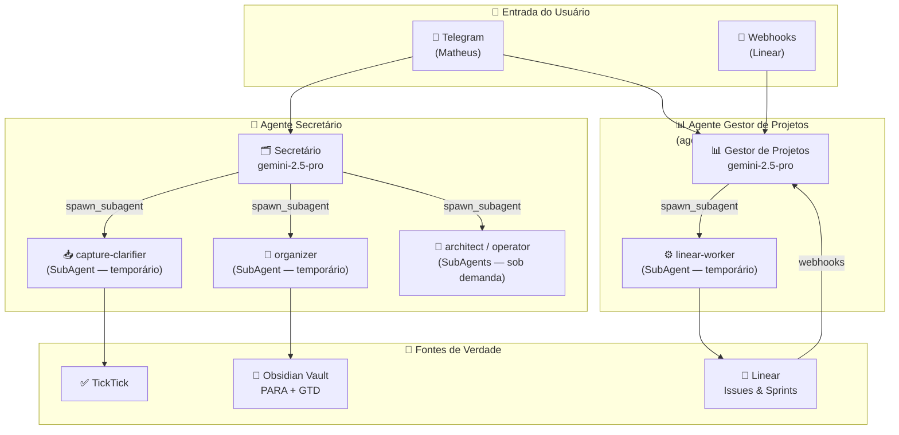
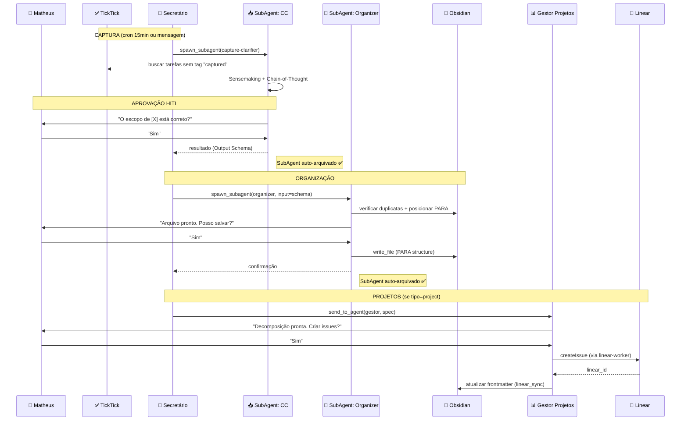

# Visão Geral — Sistema de Agentes de Produtividade Pessoal

> **Versão:** 4.0 | **Data:** 2026-03-27 | **Stack:** OpenClaw + Gemini API + VPS (Coolify)

---

## 1. Propósito do Sistema

Construir uma **estação de agentes de IA** que atue como extensão cognitiva do Matheus, eliminando o desgaste manual de organização e gestão de projetos. O sistema transforma o usuário de **executor** de tarefas organizacionais em **diretor** que apenas aprova e refina propostas dos agentes.

### Objetivos Estratégicos
| Objetivo | Métrica de Sucesso |
|---|---|
| Inbox Zero automático | 100% das capturas processadas em < 24h |
| Organização sem fricção | Zero tarefas perdidas entre TickTick ↔ Obsidian |
| Projetos sempre atualizados | Linear sincronizado com Obsidian em < 15min |
| Mente tranquila (GTD) | Revisão semanal 100% completada toda segunda |
| Visualização clara | Dashboards Kanban atualizados em tempo real |

---

## 2. Arquitetura Geral

O sistema é composto por **apenas 2 agentes** com os quais Matheus interage diretamente. Agentes especializados internos são spawned como **SubAgents temporários** — nascem, executam e se auto-arquivam.



> **Princípio:** Matheus fala apenas com Secretário e Gestor de Projetos. Tudo mais é detalhe de implementação interna.

---

## 3. Metodologias Integradas

### PARA (Organização de Pastas)
```
Obsidian Vault/
├── 0_Inbox/          → Capturas brutas (processadas pelo organizer subagent)
├── 1_Projects/       → Projetos ativos com outcome definido
├── 2_Areas/          → Áreas de responsabilidade contínua
├── 3_Resources/      → Material de referência
└── 4_Archives/       → Projetos concluídos / itens inativos
```

### GTD (Processamento de Tarefas)
```
Capturar → Esclarecer → Organizar → Refletir → Engajar
   ↓           ↓            ↓           ↓          ↓
 TickTick   SubAgent     SubAgent    Revisão    Matheus
 Telegram   capture-     organizer   Semanal    Executa
            clarifier    (PARA)      (Gestor)
```

### Contextos GTD (Para cada tarefa)
- `@dev` — Trabalho que exige ambiente de desenvolvimento
- `@reading` — Leitura e pesquisa
- `@finance` — Tarefas financeiras
- `@errands` — Tarefas externas
- `@calls` — Ligações e reuniões
- `@anywhere` — Pode fazer em qualquer lugar

---

## 4. Mapa de Agentes e Responsabilidades

### Agentes Persistentes (com canal Telegram — visíveis ao Matheus)

| Agente | Papel | Modelo | Trigger |
|---|---|---|---|
| **Secretário** | Captura, sensemaking, Obsidian | `gemini-2.5-pro` | Telegram, HEARTBEAT |
| **Gestor de Projetos** | Ponte Obsidian ↔ Linear | `gemini-2.5-pro` | Telegram, Webhooks Linear |

### SubAgents Temporários (internos — Matheus não interage diretamente)

| SubAgent | Pai | Modelo | Quando é spawned |
|---|---|---|---|
| `capture-clarifier` | Secretário | `gemini-2.5-pro` | Cron 15min ou mensagem Telegram |
| `organizer` | Secretário | `gemini-2.5-flash` | Após HITL do capture-clarifier |
| `architect` | Secretário | `gemini-2.5-pro` | Sob demanda: análise técnica profunda |
| `operator` | Secretário | `gemini-2.5-flash` | Sob demanda: CLI, Docker, logs |
| `linear-worker` | Gestor | `gemini-2.5-flash` | Criação/atualização de issues em lote |

---

## 5. Fluxo de Dados Principal



---

## 6. Configuração OpenClaw (`openclaw.json`)

```json5
// ~/.openclaw/openclaw.json
{
  gateway: {
    mode: "local",
    token: "SEU_TOKEN",
    host: "localhost",
    port: 3000
  },

  // Apenas 2 agentes persistentes com canal Telegram
  agents: [
    {
      id: "secretario",
      workspace: "~/.openclaw/workspace/secretario",
      model: "gemini/gemini-2.5-pro",
      channels: ["telegram"],
      heartbeat: { interval: "30m" }
    },
    {
      id: "gestor-projetos",
      workspace: "~/.openclaw/workspace/gestor-projetos",
      model: "gemini/gemini-2.5-pro",
      channels: ["telegram"],
      heartbeat: { interval: "30m" }
    }
  ]
  // SubAgents (capture-clarifier, organizer, linear-worker, etc.)
  // são spawned dinamicamente — não precisam de config estática aqui
}
```

### Estrutura de Arquivos OpenClaw por Agente

```
~/.openclaw/workspace/
├── secretario/
│   ├── SOUL.md        ← Identidade: "Você é o Secretário do Matheus..."
│   ├── AGENTS.md      ← Playbook: quando spawnar CC vs Organizer, protocolo HITL
│   ├── IDENTITY.md    ← Nome público, role, como se apresenta
│   ├── USER.md        ← Perfil do Matheus: projetos, preferências, fuso
│   ├── TOOLS.md       ← Convenções: TickTick CLI, Obsidian MCP, spawn_subagent
│   ├── MEMORY.md      ← Capturas em andamento, itens aguardando aprovação
│   ├── HEARTBEAT.md   ← Monitorar: inbox TickTick, 0_Inbox Obsidian
│   └── workflows/
│       └── secretario-captura.yaml
│
└── gestor-projetos/
    ├── SOUL.md        ← Identidade: "Você é o Gestor de Projetos do Matheus..."
    ├── AGENTS.md      ← Playbook: decomposição de specs, HITL, sync Linear→Obsidian
    ├── IDENTITY.md    ← Nome público, role
    ├── USER.md        ← Perfil do Matheus: projetos Linear, preferências
    ├── TOOLS.md       ← Convenções: Linear CLI, Obsidian MCP, webhook handling
    ├── MEMORY.md      ← Mapeamento linear_id ↔ nota Obsidian, sprints ativos
    ├── HEARTBEAT.md   ← Monitorar: issues paradas, burndown, webhooks pendentes
    └── workflows/
        └── gestor-weekly-review.yaml
```

---

## 7. Princípios Fundamentais

### Human-in-the-Loop (HITL)
- **Nenhuma escrita** no Obsidian sem aprovação explícita do Matheus
- **Nenhuma deleção** sem confirmação separada
- **Nenhuma criação em massa** (20+ issues) sem revisão prévia
- Aprovações pendentes são registradas em `MEMORY.md` para não serem perdidas

### Segurança e Permissões (RBAC)

| Agente/SubAgent | `write_file` | `exec_command` | `spawn_subagent` | `send_to_agent` |
|---|---|---|---|---|
| Secretário | ❌ | ❌ | ✅ (CC, ORG, Arch, Op) | ✅ (Gestor) |
| Gestor de Projetos | ❌ | ❌ | ✅ (linear-worker) | ✅ (Secretário) |
| SubAgent: organizer | ✅ (após HITL) | ❌ | ❌ | ❌ |
| SubAgent: capture-clarifier | ❌ | ✅ (TickTick) | ❌ | ❌ |
| SubAgent: linear-worker | ❌ | ✅ (Linear CLI) | ❌ | ❌ |

### Anti-Drift (MÉTODO SCAN)
Cada agente contém âncoras cognitivas em `AGENTS.md` que relembram regras imperativas em sessões longas, prevenindo degradação comportamental.

---

## 8. Stack Tecnológico

| Camada | Tecnologia |
|---|---|
| **Orquestração** | OpenClaw (Agent OS) |
| **LLM** | Google Gemini API (2.5 Flash/Pro) |
| **Fallback** | Groq (Llama 3.3 70B) |
| **Infraestrutura** | VPS + Coolify + Docker Compose |
| **Conhecimento** | Obsidian (Markdown + YAML Frontmatter) |
| **Embeddings** | Ollama (nomic-embed-text) — Zero tokens |
| **Busca Vetorial** | FAISS Index |
| **Tarefas** | TickTick API (via MCP ou CLI) |
| **Projetos** | Linear API (via MCP ou CLI) |
| **Comunicação** | Telegram Bot API |
| **Sync** | Git (Obsidian → VPS) |
| **Workflows** | Lobster (engine nativa do OpenClaw) |

---

## 9. Documentos Relacionados

- [Agente Secretário — Detalhamento](./02_agente_secretario.md)
- [Agente Gestor de Projetos — Detalhamento](./03_agente_gestor_projetos.md)
- [Dashboards e Revisão Semanal](./04_dashboards_e_revisao.md)
- [OpenClaw — Referência Técnica](./05_openclaw_referencia_tecnica.md)
