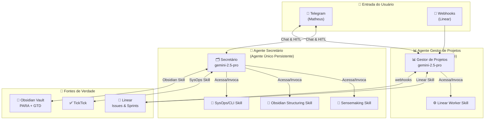
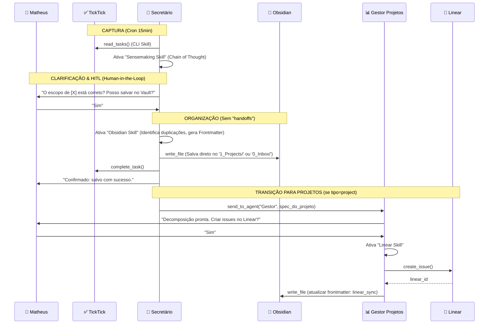

# Visão Geral — Sistema de Agentes de Produtividade Pessoal

> **Versão:** 4.1 | **Data:** 2026-03-27 | **Stack:** OpenClaw + Gemini API + VPS (Coolify)

---

## 1. Propósito do Sistema

Construir uma **estação de agentes de IA** que atue como extensão cognitiva do Matheus, eliminando o desgaste manual de organização e gestão de projetos. O sistema transforma o usuário de **executor** de tarefas organizacionais em **diretor** que apenas aprova e refina propostas dos agentes.

### Objetivos Estratégicos
| Objetivo | Métrica de Sucesso |
|---|---|
| Inbox Zero automático | 100% das capturas processadas em < 24h |
| Organização sem fricção | Zero tarefas perdidas entre TickTick ↔ Obsidian |
| Projetos sempre atualizados | Linear sincronizado com Obsidian em < 15min |
| Mente tranquila (GTD) | Revisão semanal 100% completada toda segunda |
| Visualização clara | Dashboards Kanban atualizados em tempo real |

---

## 2. Arquitetura Geral (Orientada a Skills)

O sistema é composto por **agentes persistentes e monolíticos** (sem subagentes). Matheus interage diretamente com eles. Para adquirir capacidades especializadas de ferramentas ou metodologias, os agentes equipam conjuntos de regras locais conhecidas como **Skills**.



> **Princípio de Centralização:** A inteligência processual não é delegada. O Secretário e o Gestor de Projetos mantêm integralmente o Chain-of-Thought ("linha de raciocínio") de todo o fluxo, agindo de forma veloz ao engajar as *Skills* necessárias num processo único de execução.

---

## 3. Metodologias Integradas

### PARA (Organização de Pastas)
```
Obsidian Vault/
├── 0_Inbox/          → Capturas brutas (aguardando Sensemaking Skill)
├── 1_Projects/       → Projetos ativos com outcome definido
├── 2_Areas/          → Áreas de responsabilidade contínua
├── 3_Resources/      → Material de referência
└── 4_Archives/       → Projetos concluídos / itens inativos
```

### GTD (Processamento de Tarefas)
```
Capturar → Esclarecer → Organizar → Refletir → Engajar
   ↓           ↓            ↓           ↓          ↓
 TickTick    Secretário   Secretário   Revisão    Matheus
 Telegram   (Sensemaking) (Obsidian)   Semanal    Executa
                                       (Gestor)
```

### Contextos GTD (Para cada tarefa)
- `@dev` — Trabalho que exige ambiente de desenvolvimento
- `@reading` — Leitura e pesquisa
- `@finance` — Tarefas financeiras
- `@errands` — Tarefas externas
- `@calls` — Ligações e reuniões
- `@anywhere` — Pode fazer em qualquer lugar

---

## 4. Mapa de Agentes e Ferramentas Acopladas

O ecossistema deixou de basear-se na interconexão fracionada de subagentes para concentrar-se nestes dois núcleos cognitivos.

| Agente (Cognição Core) | Capacidades (Skills Acopladas) | Modelo | Trigger Principal |
|---|---|---|---|
| **Secretário** | - Sensemaking Skill<br>- Obsidian Structuring Skill<br>- SysOps / CLI Skill<br>- Arch & Design Skill | `gemini-2.5-pro` | Telegram, HEARTBEAT (Cron) |
| **Gestor de Projetos** | - Linear Worker Skill<br>- Obsidian Sync Skill | `gemini-2.5-pro` | Telegram, Webhooks Linear |

*Nota: As "Skills" não são agentes separados; são manuais de instruções formais (`guides` ou `md files` específicos) e conjuntos de ferramentas habilitadas no prompt do próprio agente principal.*

---

## 5. Fluxo de Dados Principal (Pipeline Simplificado)



---

## 6. Configuração OpenClaw (`openclaw.json`) e Diretórios

```json5
// ~/.openclaw/openclaw.json
{
  gateway: {
    mode: "local",
    token: "SEU_TOKEN",
    host: "localhost",
    port: 3000
  },

  // Apenas 2 agentes persistentes. Sem subagentes voláteis.
  agents: [
    {
      id: "secretario",
      workspace: "~/.openclaw/workspace/secretario",
      model: "gemini/gemini-2.5-pro",
      channels: ["telegram"],
      heartbeat: { interval: "30m" }
    },
    {
      id: "gestor-projetos",
      workspace: "~/.openclaw/workspace/gestor-projetos",
      model: "gemini/gemini-2.5-pro",
      channels: ["telegram"],
      heartbeat: { interval: "30m" }
    }
  ]
}
```

### Estrutura de Arquivos OpenClaw por Agente

As regras de comportamento de subagentes deram lugar à pasta `skills/`.

```
~/.openclaw/workspace/
├── secretario/
│   ├── SOUL.md        ← Identidade raiz do Agente
│   ├── AGENTS.md      ← Playbook de como e quando engajar cadeias de pensamento (Skills)
│   ├── IDENTITY.md    ← Nome público, role
│   ├── USER.md        ← Perfil do Matheus: referências contextuais
│   ├── TOOLS.md       ← Permissões de manipulação do disco/APIs locais
│   ├── MEMORY.md      ← Ações pendentes de aprovação, logs
│   ├── HEARTBEAT.md   ← Gatilhos de monitoramento
│   ├── workflows/     ← (Ex. secretario-captura.yaml)
│   └── skills/        ← Manuais lidos em Runtime
│       ├── sensemaking_skill.md
│       ├── obsidian_structuring_skill.md
│       └── sysops_skill.md
│
└── gestor-projetos/
    ├── skills/        ← Manuais do gestor local
    │   └── linear_worker_skill.md
    └── ...
```

---

## 7. Princípios Fundamentais Atualizados

### Segurança Endurecida e HITL (Novo Paradigma)
> :warning: **PERIGO:** Ao remover os subagentes e delegar a capacidade `write_file` diretamente ao Agente Secretário, os riscos de "alucinações modificadoras" (editar arquivos errados) são potencializados.

Por este motivo, regras absolutas:
- **Nenhuma escrita (write_file/edit_file)** no Obsidian sem a instrução prévia ter passado por um crivo manual explícito ("Posso salvar? -> Sim") ou ser orientada pela `Obsidian Structuring Skill`.
- **Nenhuma deleção** do Obsidian, mesmo com pedido: mover ao invés de deletar.

| Agente Core | Ferramentas Críticas (Permissões) | Requisição de HITL |
|---|---|---|
| **Secretário** | `write_file`, `exec_command(TickTick/Terminal)` | **Sim**, oponente/escrita final depende do Usuário. (Com exceção da flag "captured" no Ticktick) |
| **Gestor de Projetos** | `write_file`, `exec_command(Linear CLI)` | **Sim**, para criação em lote e modificações estruturais grandes. |

### Anti-Drift (MÉTODO SCAN Constante)
Como as sessões concentradas em um único agente podem alucinar e perder foco em `system_prompts` extensos, o agente recarregará (SCAN) sua `SOUL.md` e a respectiva `skill.md` associada à tarefa a cada mudança severa de contexto no "Heartbeat".

---

## 8. Documentos Relacionados

- [Agente Secretário — Detalhamento e Skills](./02_agente_secretario.md)
- [Agente Gestor de Projetos — Detalhamento](./03_agente_gestor_projetos.md)
- [Dashboards e Revisão Semanal](./04_dashboards_e_revisao.md)
- [OpenClaw — Referência Técnica](./05_openclaw_referencia_tecnica.md)
