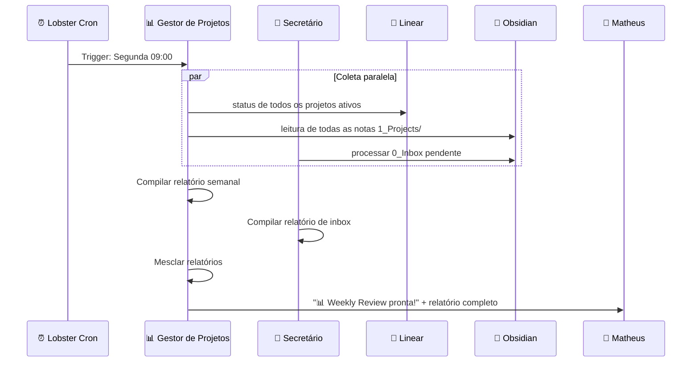
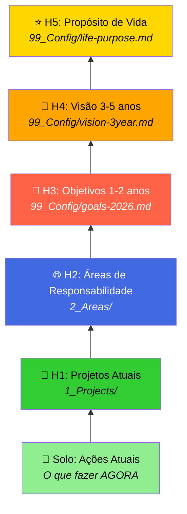
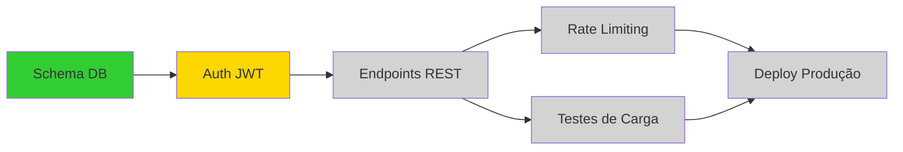

# Dashboards, Visualizações e Revisão Semanal

> **Objetivo:** Fornecer visibilidade total sobre tarefas, projetos e estados do sistema, permitindo relaxar sabendo que o fluxo de organização funciona.

---

## 1. Filosofia de Visualização

> *"Se não consigo ver, não consigo confiar."*

O objetivo das visualizações é dar **confiança** de que o sistema está funcionando. O Matheus precisa ver em *um olhar*:
- Onde estou em cada projeto
- O que precisa de atenção imediata
- O que está bloqueado
- O que vem a seguir

---

## 2. Dashboard Kanban Principal (Obsidian Dataview)

### 2.1 Implementação via Dataview

O Obsidian com plugin **Dataview** permite criar dashboards dinâmicos a partir dos frontmatters YAML gerenciados pelo SubAgent `organizer`:

#### Kanban de Projetos
```dataview
TABLE status AS "Status", progress AS "Progresso", outcome AS "Outcome"
FROM "1_Projects"
WHERE type = "project" AND status != "completed"
SORT progress DESC
```

#### Visualização por Contexto GTD
```dataview
TABLE context AS "Contexto", status AS "Status", date_created AS "Criado"
FROM "1_Projects" OR "0_Inbox"
WHERE status = "active"
GROUP BY context
SORT context ASC
```

#### Tarefas Aguardando
```dataview
LIST
FROM "1_Projects" OR "2_Areas"
WHERE status = "waiting"
SORT date_created DESC
```

### 2.2 Kanban Board Visual (Plugin Kanban do Obsidian)

```
┌─────────────┬──────────────┬──────────────┬──────────────┬──────────────┐
│   📥 Inbox  │  🔄 Active   │ ⏳ Waiting   │  📋 Next     │  ✅ Done     │
├─────────────┼──────────────┼──────────────┼──────────────┼──────────────┤
│ Nova ideia  │ VOLTZ API v2 │ Resposta do  │ DEK Landing  │ Schema DB    │
│ de feature  │ [35%]        │ Pedro        │ Page         │ VOLTZ        │
│             │              │              │              │              │
│ Artigo      │ OpenFang     │ Aprovação    │ Testes de    │ Setup        │
│ sobre RAG   │ Agents [60%] │ orçamento    │ carga API    │ Coolify      │
│             │              │              │              │              │
│ Link do     │ WappTV       │              │ CI/CD VOLTZ  │              │
│ Telegram    │ Search [20%] │              │              │              │
└─────────────┴──────────────┴──────────────┴──────────────┴──────────────┘
```

> Os dados são atualizados automaticamente: o SubAgent `organizer` gerencia frontmatters YAML, e o Gestor de Projetos sincroniza o campo `progress` a partir do Linear.

---

## 3. Dashboards por Área

### 3.1 Painel de Projetos por Área

```
📐 PROJETOS ATIVOS POR ÁREA
═══════════════════════════════════════════════════
🏗️ VOLTZ          ████████░░░░ 35%  │ 5 issues │ 1 bloqueio
📺 WappTV         ██░░░░░░░░░░ 20%  │ 3 issues │ 0 bloqueios
🤖 OpenFang       ██████████░░ 60%  │ 8 issues │ 0 bloqueios
🏛️ DEK            ░░░░░░░░░░░░  5%  │ 2 issues │ 1 bloqueio
👤 Pessoal        ████████████ 100% │ 0 issues │ 0 bloqueios
═══════════════════════════════════════════════════
```

### 3.2 Arquivo de Dashboard Master

```yaml
---
type: "dashboard"
auto_update: true
last_updated: "2026-03-27T11:39:00-03:00"
---

# 📊 Dashboard Master

## Métricas-Chave
- **Inbox pendente:** 3 itens
- **Projetos ativos:** 4
- **Issues abertas Linear:** 18
- **Tarefas aguardando:** 2
- **Próxima revisão:** Segunda 09:00

## Alertas
- ⚠️ VOLTZ-121 parada há 5 dias
- 📅 Sprint 4 termina em 3 dias (3/8 completas)
```

---

## 4. Revisão Semanal Automatizada

### 4.1 Estrutura da Revisão (GTD Weekly Review)

A revisão semanal é o **motor de confiança** do sistema GTD. Sem ela, o sistema degrada. O Workflow Lobster `gestor-weekly-review` dispara automaticamente toda **Segunda às 09:00** — orquestrado pelo Gestor de Projetos, com contribuição do Secretário.



### 4.2 Checklist da Revisão Semanal

```
┌──────────────────────────────────────────────────────────┐
│               📋 REVISÃO SEMANAL AUTOMATIZADA             │
│                                                           │
│  FASE 1: LIMPAR (Secretário)                             │
│  ┌────────────────────────────────────────────────────┐   │
│  │ □ Processar 100% do 0_Inbox/                       │   │
│  │ □ Esvaziar notas soltas sem frontmatter            │   │
│  │ □ Verificar TickTick inbox (tarefas não capturadas)│   │
│  │ □ Revisar itens "Talvez Um Dia"                    │   │
│  └────────────────────────────────────────────────────┘   │
│                                                           │
│  FASE 2: ATUALIZAR (Gestor de Projetos)                  │
│  ┌────────────────────────────────────────────────────┐   │
│  │ □ Verificar status de todos os projetos ativos     │   │
│  │ □ Atualizar % progresso de cada projeto            │   │
│  │ □ Identificar issues paradas > 5 dias              │   │
│  │ □ Verificar se Sprint atual está no prazo          │   │
│  │ □ Sincronizar Linear ↔ Obsidian                    │   │
│  └────────────────────────────────────────────────────┘   │
│                                                           │
│  FASE 3: ANALISAR (Gestor de Projetos)                   │
│  ┌────────────────────────────────────────────────────┐   │
│  │ □ Cruzar tarefas com Horizontes de Foco (H1-H5)   │   │
│  │ □ Detectar projetos sem próxima ação definida      │   │
│  │ □ Identificar áreas negligenciadas                 │   │
│  │ □ Calcular velocity semanal (issues fechadas)      │   │
│  └────────────────────────────────────────────────────┘   │
│                                                           │
│  FASE 4: DECIDIR (Matheus via Telegram)                  │
│  ┌────────────────────────────────────────────────────┐   │
│  │ □ Revisar relatório compilado                      │   │
│  │ □ Reavaliar prioridades da próxima semana          │   │
│  │ □ Arquivar projetos concluídos                     │   │
│  │ □ Definir foco semanal (user-preferences.md)       │   │
│  └────────────────────────────────────────────────────┘   │
└──────────────────────────────────────────────────────────┘
```

### 4.3 Template do Relatório Semanal

```markdown
# 📊 Weekly Review — Semana 13 (24-30 Mar 2026)

## 📥 Inbox (Secretário)
- **Processados esta semana:** 12 itens
- **Pendentes:** 3 itens
- **Fontes:** TickTick (8), Telegram (4)

## 📂 Projetos Ativos (Gestor de Projetos)
| Projeto | Progresso | Issues | Sprint | Status |
|---------|-----------|--------|--------|--------|
| VOLTZ API v2 | 35% → 50% | 3/5 ✅ | Sprint 4 | 🟡 Risco |
| WappTV Search | 20% → 25% | 1/3 ✅ | - | 🟢 OK |
| OpenFang Agents | 60% → 75% | 6/8 ✅ | - | 🟢 OK |
| DEK Platform | 5% → 5% | 0/2 ✅ | - | 🔴 Parado |

## ⚠️ Alertas
- 🔴 DEK Platform sem movimento em 2 semanas
- 🟡 VOLTZ Sprint 4: apenas 3/8 issues completas

## ✅ Conquistas da Semana
- OpenFang: 2 agentes finalizados e testados
- VOLTZ: Schema do banco aprovado

## 🎯 Foco Sugerido para Próxima Semana
1. **VOLTZ:** Desbloquear issue de auth JWT
2. **DEK:** Reunião com stakeholder para definir escopo
3. **WappTV:** Implementar endpoint de busca

## 📈 Métricas
- Velocity: 7 issues/semana (↑ de 5)
- Inbox zero: atingido 5/7 dias
- Revisões diárias: 7/7 completadas
```

---

## 5. Revisão Diária (Mini-Review)

### 5.1 HEARTBEAT + Cron: Diariamente às 18:00

O Gestor de Projetos tem um cron diário às 18:00. O Secretário monitora via HEARTBEAT continuamente. Juntos, garantem o daily review:

```
┌────────────────────────────────────────────┐
│          📋 DAILY REVIEW (18:00)            │
│                                             │
│  Secretário:                                │
│  1. Processar 0_Inbox/ restante            │
│  2. Verificar pendências TickTick          │
│                                             │
│  Gestor de Projetos:                        │
│  3. Verificar "Próximas Ações" de amanhã   │
│  4. Conferir tarefas "Aguardando"          │
│  5. Enviar resumo via Telegram:             │
│     "📋 Hoje: 5 tarefas feitas,            │
│      2 pendentes para amanhã.              │
│      Inbox: 1 item novo."                  │
└────────────────────────────────────────────┘
```

### 5.2 Sumário Matinal (07:00 — Gestor de Projetos)

```
☀️ Bom dia, Matheus!

📋 Hoje (TickTick):
• Revisar rotas WappTV com Pedro (15:00) — 🔴 Alta
• Finalizar schema VOLTZ — 🟡 Média
• Ler artigo sobre RAG — 🔵 Baixa

📊 Projetos:
• VOLTZ Sprint 4: 4/8 issues (2 dias restantes)
• OpenFang: deploy do capture-clarifier hoje

💡 Baseado nas notas de ontem: VOLTZ-121 ainda em progresso há 3 dias.
   Investigar bloqueios hoje?
```

---

## 6. Horizontes de Foco GTD



O Gestor de Projetos, na revisão semanal, **cruza cada projeto ativo com seu horizonte**:
- Projeto sem conexão com H2+ → questionar necessidade
- Área sem projetos ativos → alertar negligência
- Meta H3 sem projeto ativo → sugerir criação

---

## 7. Visualizações Adicionais

### 7.1 Mapa de Calor de Atividade
```
Mar 2026
Lu  ██ ██ ██ ██
Ma  ██ ██ ░░ ██
Qu  ██ ░░ ██ ██
Qu  ██ ██ ██ ░░
Se  ██ ██ ██ ██
Sa  ░░ ░░ ░░ ░░
Do  ░░ ░░ ░░ ░░

██ = Inbox Zero alcançado  ░░ = Itens pendentes
```

### 7.2 Grafo de Dependências (Mermaid)


### 7.3 Burndown Chart (via Linear)
O Linear já fornece burndown nativamente por Sprint. O Gestor extrai esses dados na revisão semanal via `exec_command: linear-cli.js sprint --team VOLTZ` e inclui no relatório.

---

## 8. Implementação Técnica

### 8.1 Plugins Obsidian Recomendados
| Plugin | Função |
|---|---|
| **Dataview** | Queries dinâmicas para dashboards |
| **Kanban** | Board visual com drag-and-drop |
| **Calendar** | Visualização temporal de tarefas |
| **Templater** | Templates automáticos para novas notas |
| **Obsidian Git** | Sync automático com VPS a cada 15min |

### 8.2 Automação dos Dashboards
Os dashboards são **auto-atualizados** porque dependem de queries Dataview que leem os frontmatters YAML. Qualquer mudança feita pelo SubAgent `organizer` ou pelo Gestor de Projetos se reflete automaticamente — sem nenhuma ação manual.

### 8.3 Notificações via Telegram
| Tipo | Responsável | Horário | Conteúdo |
|---|---|---|---|
| ☀️ Sumário Matinal | Gestor de Projetos | 07:00 | Tarefas do dia + status projetos |
| 📋 Daily Review | Gestor + Secretário | 18:00 | Resumo do dia + pendências |
| 📊 Weekly Review | Gestor de Projetos | Segunda 09:00 | Relatório completo da semana |
| ⚠️ Alertas HEARTBEAT | Gestor ou Secretário | Tempo real | Issues paradas, bloqueios, inbox acumulando |
